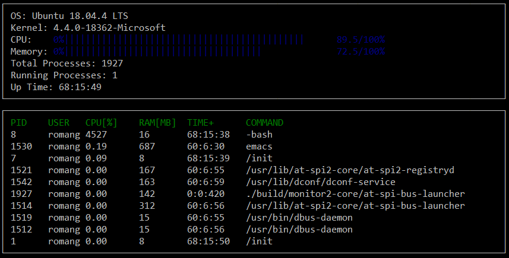

# CppND-System-Monitor

Code for System Monitor Project in the Object Oriented Programming Course of the [Udacity C++ Nanodegree Program](https://www.udacity.com/course/c-plus-plus-nanodegree--nd213). 

## Instructions

1. Clone the project repository: `git clone https://github.com/rg1964/computer_system_monitor.git`

2. Build the project: `make build`

3. Run the resulting executable: `./build/monitor`

